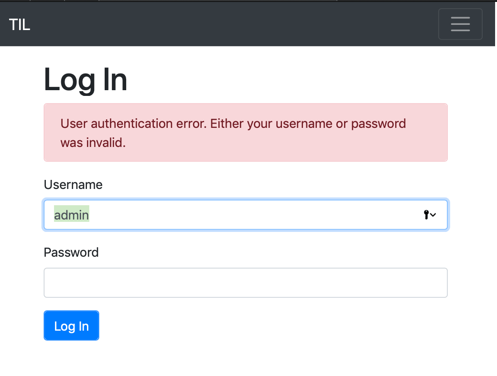
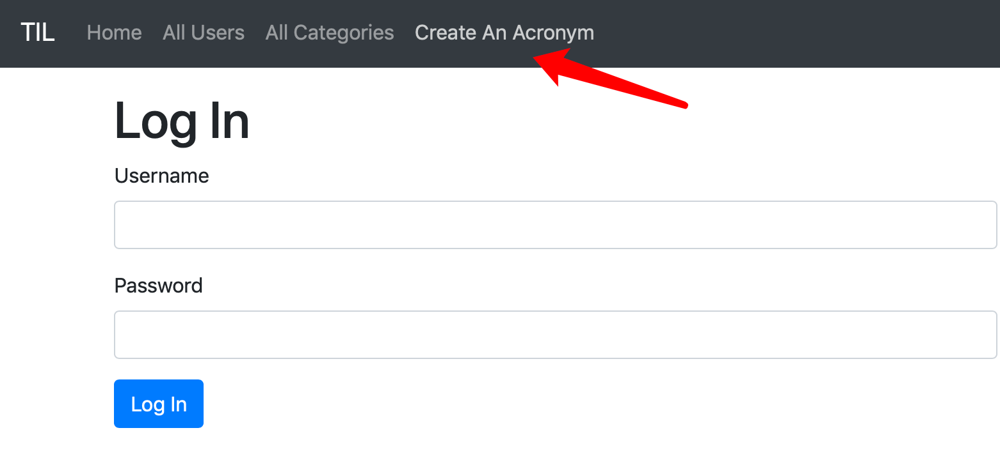
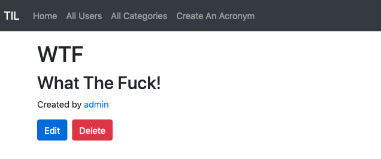
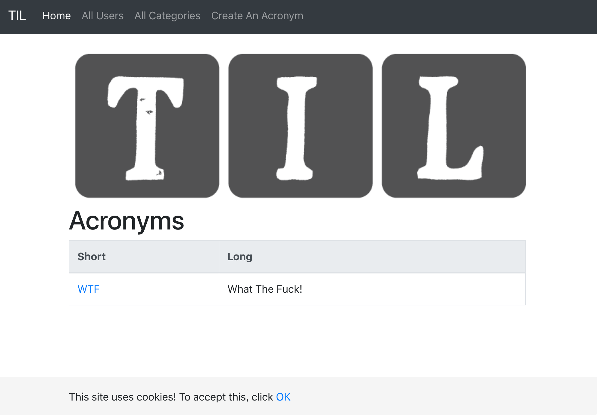

Cookie是服务器应用发送给浏览器存放在用户计算机上的小块信息，因为对于浏览器来说，在请求网页时是不能设置自定义头部信息的，所以浏览器在访问服务端应用时会在请求中带上服务端应用发给它的cookie信息。Session能够在多次不同的请求中保存状态信息，在用户验证过程中，服务端会给用户创建一个会话，并使用唯一ID来标识这个会话，发送给用户的cookie中也包含这个标识会话的唯一ID，当用户向服务端应用发送请求时会带上cookie信息，所以能过唯一ID就可以识别出上哪个会话了。

Vapor使用中间件来管理会话

*configure.swift*
```swift
...
middlewares.use(SessionsMiddleware.self)
...
config.prefer(MemoryKeyedCache.self, for: KeyedCache.self)
```

*User.swift*
```swift
...
extension User: PasswordAuthenticatable {}
extension User: SessionAuthenticatable {}
```

使用会话中间件，并配置了键值存储服务，让用户遵循密码验证和会话验证协议。

要实现用户登录需要提供两个api, 一个用来显示登录页面，另一个用来接收用户登录信息。


*WebsiteController.swift*

```swift

struct LoginContext: Encodable {
    let title = "Log In"
    let loginError: Bool
    
    init(loginError: Bool = false) {
        self.loginError = loginError
    }
}

...

    func loginHandler(_ req: Request) throws -> Future<View> {
        let context: LoginContext
        
        if req.query[Bool.self, at: "error"] != nil {
            context = LoginContext(loginError: true)
        } else {
            context = LoginContext()
        }
        
        return try req.view().render("login", context)
    }
    ...
```

页面api和页面参数结构定义好了，我们需要创建页面模板文件来渲染页面显示。

```login.leaf
#set("content") {

<h1>#(title)</h1>

#if(loginError) {
    <div class="alert alert-danger" role="alert">
        User authentication error. Either your username or password
        was invalid.
    </div>
}
<form method="post">
    <div class="form-group">
        <label for="username">Username</label>
        <input type="text" name="username" class="form-control"
        id="username"/>
    </div>
    <div class="form-group">
        <label for="password">Password</label>
        <input type="password" name="password" class="form-control"
        id="password"/>
    </div>
    <button type="submit" class="btn btn-primary">Log In</button>
</form>
}
#embed("base")
```

*WebsiteController.swift*

```swift
...
import Authentication
...
struct LoginPostData: Content {
    let username: String
    let password: String
}
...
    func boot(router: Router) throws {
        ...
        router.get("login", use: loginHandler)
        router.post(LoginPostData.self, at: "login", use: loginPostHandler)
    }
    func loginPostHandler(_ req: Request, userData: LoginPostData) throws -> Future<Response> {
        return User.authenticate(username: userData.username, password: userData.password, using: BCryptDigest(), on: req).map(to: Response.self) {
            user in
            
            guard let user = user else {
                return req.redirect(to: "/login?error")
            }
            
            try req.authenticateSession(user)
            return req.redirect(to: "/")
        }
    }
```



登录页面建好后，我们就要通过认证用户身份来保护API，使用会话认证中间件。

*WebsiteController.swift*

```swift 
    func boot(router: Router) throws {
        let authSessionRoutes = router.grouped(User.authSessionsMiddleware())
        authSessionRoutes.get(use: indexHandler)
        authSessionRoutes.get("acronyms", Acronym.parameter, use: acronymHandler)
        authSessionRoutes.get("users", User.parameter, use: userHandler)
        authSessionRoutes.get("users", use: allUsersHandler)
        authSessionRoutes.get("categories", use: allCategoriesHandler)
        authSessionRoutes.get("categories", Category.parameter, use: categoryHandler)
        authSessionRoutes.get("login", use: loginHandler)
        
        let protectedGroup = authSessionRoutes.grouped(RedirectMiddleware<User>(path: "/login"))
        protectedGroup.get("acronyms", "create", use: createAcronymHandler)
        protectedGroup.get("acronyms", Acronym.parameter, "edit", use: editAcronymHandler)
        protectedGroup.post("acronyms", Acronym.parameter, "edit",  use: editAcronymPostHandler)
        protectedGroup.post("acronyms", Acronym.parameter, "delete", use: deleteAcronymHandler)
        protectedGroup.post(CreateAcronymData.self, at: "acronyms", "create", use: createAcronymPostHandler)
        
        router.post(LoginPostData.self, at: "login", use: loginPostHandler)
    }
```



有了对api进行用户认证的保护手段后，我们需要更新一下网站。因为我们可以从认证信息中获取到用户的UserID，所以可以更新一些数据结构：

*WebsiteController.swift*

```swift
struct CreateAcronymData: Content {
    let short: String
    let long: String
    let categories: [String]?
}
...
    func createAcronymPostHandler(_ req: Request, data: CreateAcronymData) throws -> Future<Response> {
        
        let user = try req.requireAuthenticated(User.self)
        let acronym = try Acronym(short: data.short, long: data.long, userID: user.requireID())
        
        ...
    }

    func editAcronymPostHandler(_ req: Request) throws -> Future<Response> {
    return try flatMap(to: Response.self,
                        req.parameters.next(Acronym.self),
                        req.content.decode(CreateAcronymData.self)
    ) { acronym, data in
        ...
        let user = try req.requireAuthenticated(User.self)
        acronym.userID = try user.requireID()
        ...
    }

```

现在创建和编辑缩略语的两个api都可以在认证信息中获取用户信息，就不需要在页面中输入用户了。

*createAcronym.leaf*

```html
    <div class="form-group">
        <label for="userID">User</label>
        <select name="userID" class="form-control" id="userID">
            #for(user in users) {
                <option value="#(user.id)" #if(editing){ #if(acronym.userID == user.id) { selected }}>
                    #(user.name)
                </option>
            }
        </select>
    </div>
```

这一部分可以删除了。然后再更新一下对应的api，因为创建和编辑缩略词使用同一份模板，所有我们只需要改一下位置。

*WebsiteController.swift*

```swift
struct CreateAcronymContext: Encodable {
    let title = "Create An Acronym"
}
struct EditAcronymContext: Encodable {
    let title = "Edit Acronym"
    let acronym: Acronym
    let editing = true
    let categories: Future<[Category]>
}
    ...
    func createAcronymHandler(_ req: Request) throws -> Future<View> {
        let context = CreateAcronymContext()
        return try req.view().render("createAcronym", context)
    }
    ...
    func editAcronymHandler(_ req: Request) throws -> Future<View> {
        return try req.parameters.next(Acronym.self)
            .flatMap(to: View.self) { acronym in
                let categories = try acronym.categories.query(on: req).all()
                let context = EditAcronymContext(acronym: acronym,
                                                    categories: categories)
                return try req.view().render("createAcronym", context)
        }
    }
    ...
```



# 退出登录

现在可以认证用户身份并成功登录，还需要添加一个退出登录的功能。

*WebsiteController.swift*

```swift
...
    func boot(router: Router) throws {
        ....
        authSessionRoutes.post("logout", use: logoutHandler)
    ...
    func logoutHandler(_ req: Request) throws -> Response {
        try req.unauthenticate(User.self)
        return req.redirect(to: "/")
    }
```

*base.leaf*

```html
        ...
        </ul>
        #if(userLoggedIn) {
            <form class="form-inline" action="/logout" method="POST">
            <input class="nav-link btn btn-link" type="submit"
            value="Log out">
            </form>
        }
    </div>
</nav>
...
```

*WebsiteController.swift*

```swift

struct IndexContext: Encodable {
    let title: String
    let acronyms: [Acronym]?
    let userLoggedIn: Bool
}
...
    func indexHandler(_ req: Request) throws -> Future<View> {
        return Acronym.query(on: req).all()
            .flatMap(to: View.self) { acronyms in
                let userLoggedIn = try req.isAuthenticated(User.self)
                let acronymsData = acronyms.isEmpty ? nil : acronyms
                let context = IndexContext(title: "Homepage", acronyms: acronymsData, userLoggedIn: userLoggedIn)
                   return try req.view().render("index", context)
        }
    }
```


# Cookie

Web上经常使用Cookie技术，第一次登录一个网站时，一般都会提示你网站要设置Cookie，需要用户确认。我们已经使用Cookie进行用户认证，但有时我们需要设置或读取cookie信息。下面就来实现让用户确认使用cookie的功能

*base.leaf*
```html
...
        <link rel="stylesheet" href="/styles/style.css">
        <title>#(title) | Acronyms</title>
...
        #if(showCookieMessage) {
            <footer id="cookie-footer">
                <div id="cookieMessage" class="container">
                    <span class="muted">
                        This site uses cookies! To accept this, click
                        <a href="#" onclick="cookiesConfirmed()">OK</a>
                    </span>
                </div>
            </footer>
            <script src="/scripts/cookies.js"></script>
        }
        ...
        <script src="https://cdnjs.cloudflare.com/ajax/libs/popper.js/1.14.3/umd/popper.min.js" integrity="sha384-ZMP7rVo3mIykV+2+9J3UJ46jBk0WLaUAdn689aCwoqbBJiSnjAK/l8WvCWPIPm49" crossorigin="anonymous"></script>
        ...
    </body>
  ```


*Public/styles/style.css*
```css
#cookie-footer {
    position: absolute;
    bottom: 0;
    width: 100%;
    height: 60px;
    line-height: 60px;
    background-color: #f5f5f5;
}
```

*Public/scripts/cookies.js*
```js
function cookiesConfirmed() {
    $("#cookie-footer").hide();
    var d = new Date();
    d.setTime(d.getTime() + (365*24*60*60*1000));
    var expires = "expires="+ d.toUTCString();
    document.cookie = "cookies-accepted=true;" + expires;
}
```

*WebsiteController.swift*
```swift
struct IndexContext: Encodable {
    let title: String
    let acronyms: [Acronym]?
    let userLoggedIn: Bool
    let showCookieMessage: Bool
}
...
    
    func indexHandler(_ req: Request) throws -> Future<View> {
        return Acronym.query(on: req).all()
            .flatMap(to: View.self) { acronyms in
                let userLoggedIn = try req.isAuthenticated(User.self)
                let acronymsData = acronyms.isEmpty ? nil : acronyms
                let showCookieMessage = req.http.cookies["cookies-accepted"] == nil
                
                let context = IndexContext(title: "Homepage",
                                           acronyms: acronymsData,
                                           userLoggedIn: userLoggedIn,
                                           showCookieMessage: showCookieMessage)
                
                return try req.view().render("index", context)
        }
    }
```




# Session

除了使用cookie可以进行用户认证以外，还可以使用会话进行，会话也有适用的多种场景， 其中一种就是CSRF保护，即跨站请求伪造。攻击者伪装一名用户进行破坏性请求。我们可以在表格中加入CSRF token信息来防止这种攻击，当web应用接收请求时，通这验证CSRF token的否与服务端发送出去的token是否匹配来决定是否处理该请求。

*WebsiteController.swift*
```swift
struct CreateAcronymContext: Encodable {
    let title = "Create An Acronym"
    let csrfToken: String
}
struct CreateAcronymData: Content {
    let short: String
    let long: String
    let categories: [String]?
    let csrfToken: String
}
...
    func createAcronymHandler(_ req: Request) throws -> Future<View> {
        let token = try CryptoRandom().generateData(count: 16).base64EncodedString()
        let context = CreateAcronymContext(csrfToken: token)
        try req.session()["CSRF_TOKEN"] = token
        return try req.view().render("createAcronym", context)
    }
    ...
    func createAcronymPostHandler(_ req: Request, data: CreateAcronymData) throws -> Future<Response> {
        
        let expectedToken = try req.session()["CSRF_TOKEN"]
        try req.session()["CSRF_TOKEN"] = nil
        guard expectedToken == data.csrfToken else {
            throw Abort(.badRequest)
        }
        
        ...
    }
```


*createAcronym.leaf*
```html
...
    <form method = "post">
        #if(csrfToken) {
            <input type="hidden" name="csrfToken" value="#(csrfToken)">
        }
...
```
