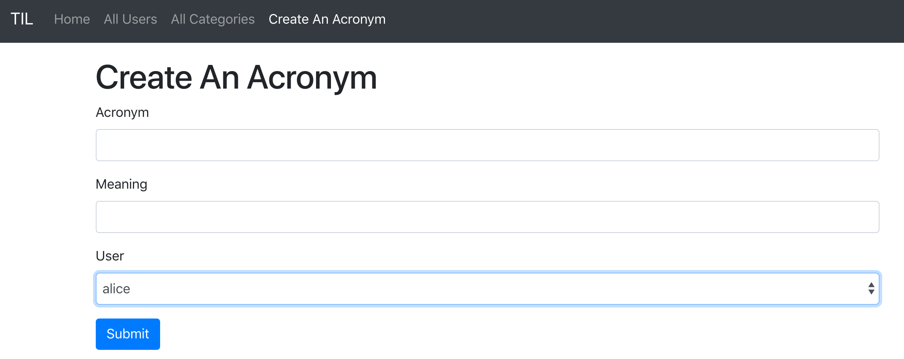

*WebsiteController.swift*
```swift
...
struct CreateAcronymContext: Encodable {
    let title = "Create An Acronym"
    let users: Future<[User]>
}
...
    router.get("acronyms", "create", use: createAcronymHandler)
    router.post(Acronym.self, at: "acronyms", "create", use: createAcronymPostHandler)
...
    func createAcronymHandler(_ req: Request) throws -> Future<View> {
        let context = CreateAcronymContext(users: User.query(on: req).all())
        return try req.view().render("createAcronym", context)
    }
    
    func createAcronymPostHandler(_ req: Request, acronym: Acronym) throws -> Future<Response> {
        return acronym.save(on: req).map(to: Response.self) { acronym in
            guard let id = acronym.id else {
                throw Abort(HTTPStatus.internalServerError)
            }
            
            return req.redirect(to: "/acronyms/\(id)")
        }
    }
...

```

*createAcronym.leaf*
```html
#set("content"){
    <h1>#(title)</h1>
    <form method = "post">
        <div class="form-group">
            <label for = "short">Acronym</label>
            <input type="text" name="short" class="form-control" id = "short"/>
        </div>
        <div class="form-group">
            <label for = "long">Meaning</label>
            <input type="text" name="long" class="form-control" id="long"/>
        </div>
        <div class="form-group">
            <label for="userID">User</label>
            <select name="userID" class="form-control" id="userID">
                #for(user in users) {
                    <option value="#(user.id)">
                        #(user.name)
                    </option>
                }
            </select>
        </div>
        <button type="submit" class = "btn btn-primary">
            Submit
        </button>
    </form>
}

#embed("base")

```

*base.leaf*
```html
...
<li class="nav-item #if(title=="Create An Acronym"){active}">
    <a href="/acronyms/create" class="nav-link">Create An Acronym</a>
</li>
...
```

