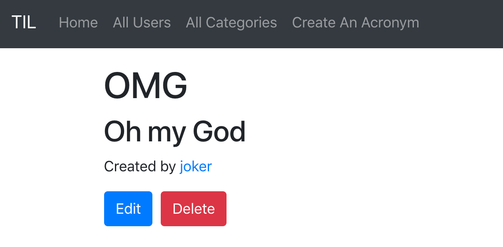

因为浏览器的关系，只能发送POST、GET请求，而不能发送DELET请求，虽然使用JS可以做到发送DELETE请求
，但这里不讨论。我们这里发送POST请求来实现删除功能。

*WebsiteController.swift*
```swift
...
router.post("acronyms", Acronym.parameter, "delete", use: deleteAcronymHandler)
...
func deleteAcronymHandler(_ req: Request) throws -> Future<Response> {
    return try req.parameters.next(Acronym.self).delete(on: req)
    .transform(to: req.redirect(to: "/"))
}
...
```

*acronym.leaf*
```html
#set("content"){
    <h1>#(acronym.short)</h1>
    <h2>#(acronym.long)</h2>
    <p>Created by <a href="/users/#(user.id)/">#(user.name)</a></p>
    <form method="post" action="/acronyms/#(acronym.id)/delete">
        <a class="btn btn-primary" href="/acronyms/#(acronym.id)/edit" role="button">Edit</a>&nbsp;
        <input class="btn btn-danger" type="submit" value="Delete" />
    </form>
}

#embed("base")
```

