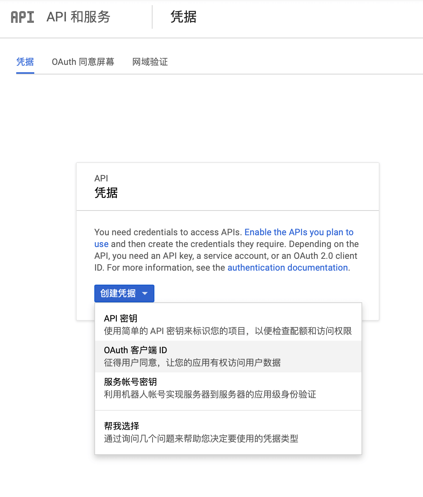
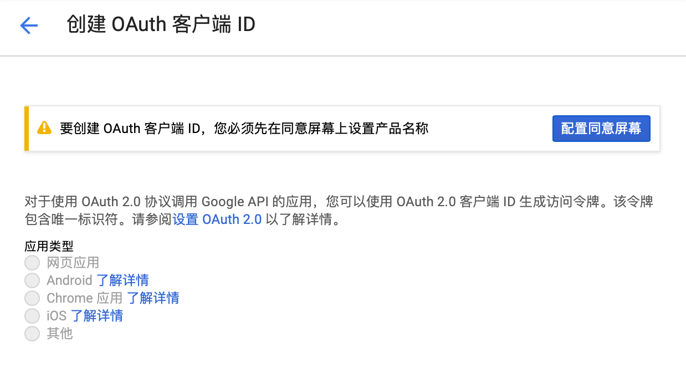
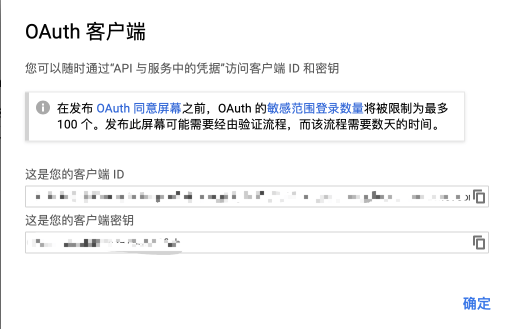
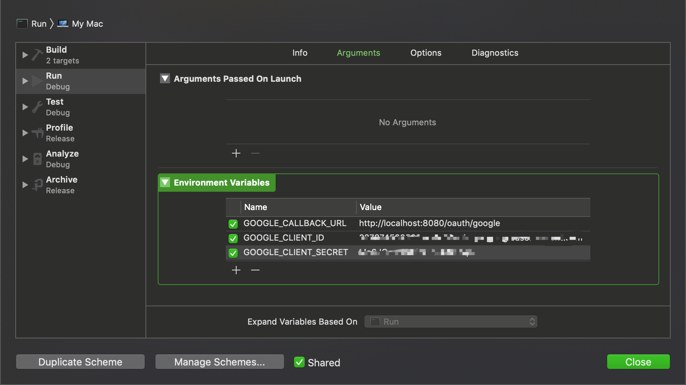
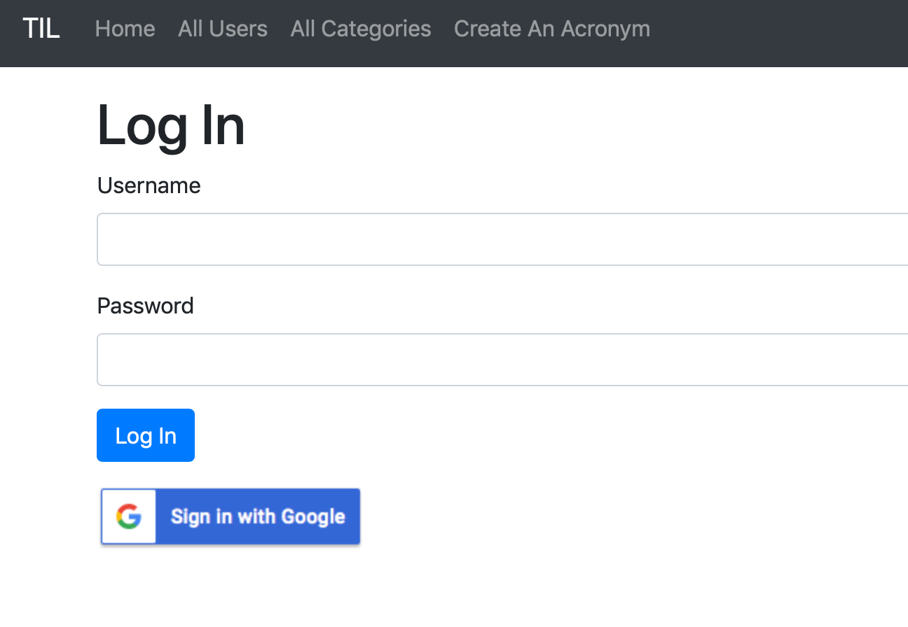

有时用户希望登录一个网站，但不想每登录一个网站就创建一个帐号，可以使用已经创建过的第三方支持OAuth的帐号登录。以Google帐号为例。

# OAuth 2.0

`OAuth 2.0`是一个用户身份认证框架，允许第三方应用访问用户信息。我们可以通过OAuth使用Google帐号登录我们之前创建的网站。我们用自己的Google帐号首先向Goolge发出用户身份认证请求，你可以允许我们的应用访问你的Google用户数据，例如电子邮件地址、头像、昵称等。允许后Google会发送你的应用一个Token，你的应用可以使用这个Token来访问Google的API。

在进行OAuth 2.0身份认证之前，你必须要有一个Google账号。

## Imperial

按照OAuth的流程写Google的认证流程是极其繁琐的事，幸好已经有三方库完成了这些繁琐的过程，这个库就是`Imperial`。

*package.swift*

```swift
...
        .package(url: "https://github.com/vapor/auth.git", from: "2.0.1"),
        .package(url: "https://github.com/vapor-community/Imperial.git", from: "0.7.0")
    ],
    targets: [
        .target(name: "App", dependencies: ["FluentPostgreSQL", "Authentication", "Vapor", "Leaf", "Imperial"]),
...
```

*ImperialController.swift*

```swift
import Vapor
import Authentication
import Imperial

struct ImperialController: RouteCollection {
    func boot(router: Router) throws {
        
    }
}
```

*routes.swift*

```swift
import Vapor

/// Register your application's routes here.
public func routes(_ router: Router) throws {
    
    ...
    
    let imperialController = ImperialController()
    try router.register(collection: imperialController)
}
```

上面我们配置了工程中支持OAuth认证的部分，之后我们需要在Google上注册我们web应用。因为Google在中国属性被墙状态，所以必须连接VPN代理才能正常访问。

## 在Google上注册应用

[注册地址](https://accounts.google.com/signin/v2/identifier?service=cloudconsole&passive=1209600&osid=1&continue=https%3A%2F%2Fconsole.developers.google.com%2Fapis%2Fcredentials&followup=https%3A%2F%2Fconsole.developers.google.com%2Fapis%2Fcredentials&flowName=GlifWebSignIn&flowEntry=ServiceLogin)








注册好我们的应用后就可以准备使用OAuth了。

*ImperialController*
```swift
//
//  ImperialController.swift
//  App
//
//  Created by joker on 2018/12/16.
//

import Vapor
import Authentication
import Imperial

struct GoogleUserInfo: Content {
    let email: String
    let name: String
}

extension Google {
    static func getUser(on req: Request) throws -> Future<GoogleUserInfo> {
        var headers = HTTPHeaders()
        headers.bearerAuthorization = try BearerAuthorization(token: req.accessToken())
        
        let googleAPIURL = "https://www.googleapis.com/oauth2/v1/userinfo?alt=json"
        
        return try req.client().get(googleAPIURL, headers: headers).map(to: GoogleUserInfo.self, { res in
            guard res.http.status == .ok else {
                if res.http.status == .unauthorized {
                    throw Abort.redirect(to: "/login-google")
                } else {
                    throw Abort(.internalServerError)
                }
            }
            return try res.content.syncDecode(GoogleUserInfo.self)
        })
    }
}

struct ImperialController: RouteCollection {
    func boot(router: Router) throws {
        
        guard let callbackURL = Environment.get("GOOGLE_CALLBACK_URL") else {
            fatalError("Callback URL not set")
        }
        
        try router.oAuth(
            from: Google.self,
            authenticate: "login-google",
            callback: callbackURL,
            scope: ["profile", "email"],
            completion: processGoogleLogin)
    }
    
    func processGoogleLogin(_ req: Request, token: String) throws -> Future<ResponseEncodable> {
        return try Google.getUser(on: req).flatMap(to: ResponseEncodable.self, { userInfo in
            return User.query(on: req).filter(\.username == userInfo.email).first().flatMap(to: ResponseEncodable.self, { foundUser in
                guard let existingUser = foundUser else {
                    let user = User(name: userInfo.name, username: userInfo.email, password: "")
                    return user.save(on: req).map(to: ResponseEncodable.self, { user in
                        try req.authenticate(user)
                        return req.redirect(to: "/")
                    })
                }
                
                try req.authenticateSession(existingUser)
                return req.future(req.redirect(to: "/"))
                
            })
        })
    }
}
```

*login.leaf*

```html
...
</form>
<a href="/login-google">
    
</a>
}
#embed("base")
```





