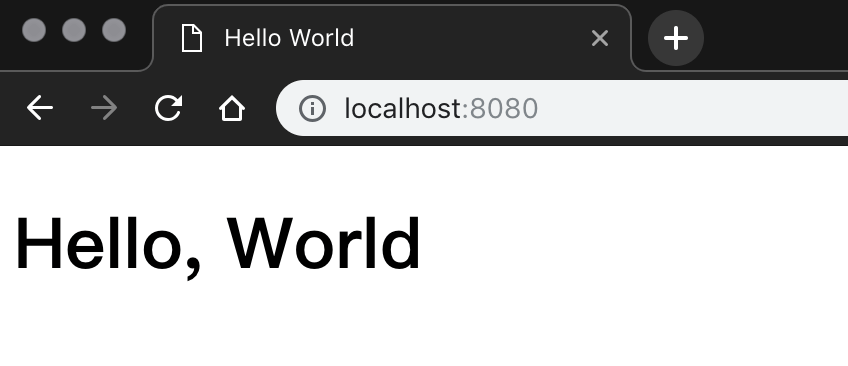
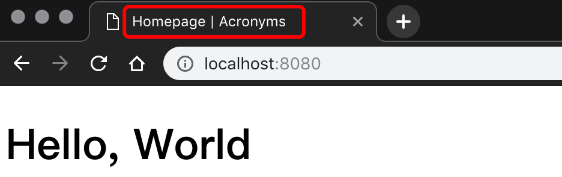
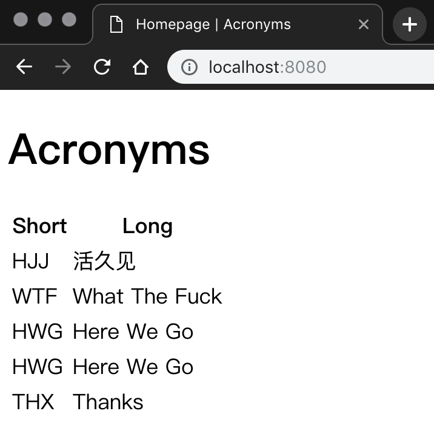
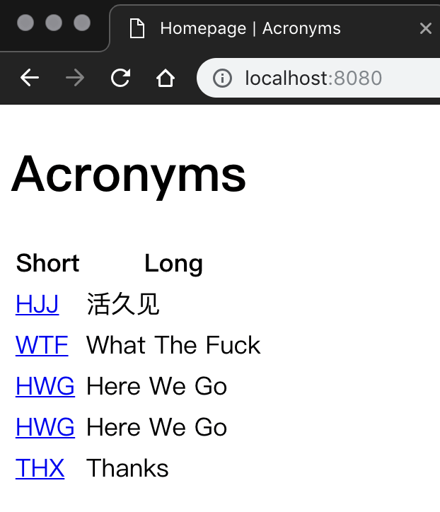
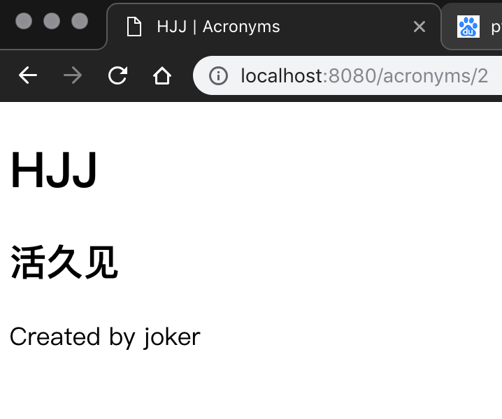

`Leaf`是Vapor框架中使用的一种模板语言。模板语言允许传递信息给页面，然后根据所传递的页面信息来动态的生成最终的HTML。模板语言也为我们开发过程中节约代码提供了方法，我们可以使用模板语言来写页面展示代码，其中可以加入各种参数变量，不同页面间也可以复用之前写好的代码块。个性页面显示方式时，有时只需要更改一处地方就可以改变所有页面的显示方式了。我们可以在一个模板中嵌套另一个模板。

我们在之前开发的后端API项目上直接开发Web页面。需要在项目的`Package.swift`文件中添加依赖:

*Package.swift*
```swift
...
.package(url: "https://github.com/vapor/leaf.git", from: "3.0.1")
...
.target(name: "App", dependencies: ["FluentPostgreSQL", "Vapor", "Leaf"]),
```

Leaf模板引擎默认使用目录`Resources/Views`, 所以我们新建一个同名目录来存放相关代码数据和文件。 `mkdir -p Resources/Views`

新建一个专门用来返回Web页面的router控制器`WebsiteController.swift`

*WebsiteController.swift*
```swift
import Vapor
import Leaf

struct WebsiteController: RouteCollection {
    
    func boot(router: Router) throws {
        router.get(use: indexHandler)
    }
    
    func indexHandler(_ req: Request) throws -> Future<View> {
        return try req.view().render("index")
    }
}
```

然后在`routes.swift`中注册控制器，使用生效:

```swift
...
let websiteController = WebsiteController()
try router.register(collection: websiteController)
...
```

还要把`Leaf`作为一种服务进行配置：
*configure.swift*
```swift
try services.register(LeafProvider())
config.prefer(LeafRenderer.self, for: ViewRenderer.self)
```



# 注入参数

`Leaf`中使用`#(arg)`的方式注入参数到页面模板中。在Vapor中很多都使用了`Codable`协议，Leaf也不例外

*index.leaf*
```html
...
<title>#(title) | Acronyms</title>
...
```

*WebsiteController.swift*
```swift
import Vapor
import Leaf

struct IndexContext: Encodable {
    let title: String
}

struct WebsiteController: RouteCollection {
    
    func boot(router: Router) throws {
        router.get(use: indexHandler)
    }
    
    func indexHandler(_ req: Request) throws -> Future<View> {
        let context = IndexContext(title: "Homepage")
        return try req.view().render("index", context)
    }
}
```



# 展示缩略语
*index.leaf*
```html
<!DOCTYPE html>

<html lang="en">
    <head>
        <meta charset="utf-8" />
        <title>#(title) | Acronyms</title>
    </head>
    <body>
        <h1>Acronyms</h1>
        #if(acronyms) {
        <table>
            <thead>
                <tr>
                    <th>Short</th>
                    <th>Long</th>
                </tr>
            </thead>
            <tbody>
                #for(acronym in acronyms) {
                <tr>
                    <td>#(acronym.short)</td>
                    <td>#(acronym.long)</td>
                    }
            </tbody>
        </table>
        } else {
            <h2>There aren't any acronyms yet!</h2>
        }
    </body>
</html>
```

*WebsiteController.wift*
```swift
import Vapor
import Leaf

struct IndexContext: Encodable {
    let title: String
    let acronyms: [Acronym]?
}

struct WebsiteController: RouteCollection {
    
    func boot(router: Router) throws {
        router.get(use: indexHandler)
    }
    
    func indexHandler(_ req: Request) throws -> Future<View> {
        return Acronym.query(on: req).all()
            .flatMap(to: View.self) { acronyms in
                let acronymsData = acronyms.isEmpty ? nil : acronyms
                let context = IndexContext(title: "Homepage", acronyms: acronymsData)
                   return try req.view().render("index", context)
        }
    }
}
```



# 跳转Acronyms详情

*index.leaf*
```html
...
<td><a href="/acronyms/#(acronym.id)">#(acronym.short)</a></td>
...
```

*acronyms.leaf*
```html
<!DOCTYPE html>

<html lang="en">
    <head>
        <meta charset="utf-8" />
        <title>#(title) | Acronyms</title>
    </head>
    <body>
        <h1>#(acronym.short)</h1>
        <h2>#(acronym.long)</h2>
        <p>Created by #(user.name)</p>
    </body>
</html>
```

*WebsiteController.swift*
```swift
...
struct AcronymContext: Encodable {
    let title: String
    let acronym: Acronym
    let user: User
}
...
        router.get("acronyms", Acronym.parameter, use: acronymHandler)
...
    func acronymHandler(_ req: Request) throws -> Future<View> {
        return try req.parameters.next(Acronym.self)
            .flatMap(to: View.self) { acronym in
                return acronym.user.get(on: req)
                    .flatMap(to: View.self) { user in
                        let context = AcronymContext(title: acronym.short, acronym: acronym, user: user)
                        return try req.view().render("acronym", context)
                }
        }
    }
```



