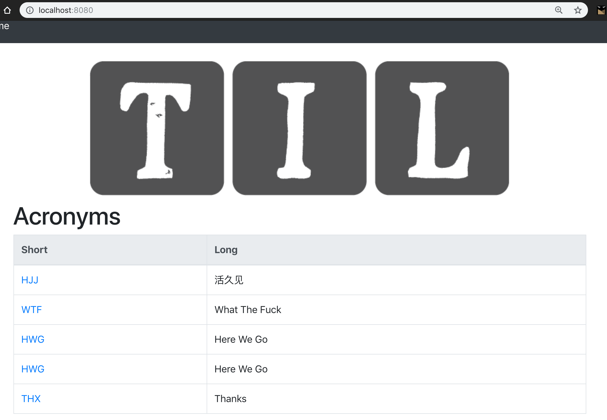

几乎每一个网站都需要存放一些静态文件，例如： 图片和样式表文件，通常这需要CDN或使用Nginx/Apache，
Vapor提供了FileMiddleware模块来完成这些事情。

要使用文件服务中间件需要注册, 默认使用`Public`目录作为文件服务的根目录，里面的文件可以是图片、样式表等：

*configure.swift*
```swift
...
    var middlewares = MiddlewareConfig() // Create _empty_ middleware config
    /// middlewares.use(FileMiddleware.self) // Serves files from `Public/` directory
    middlewares.use(ErrorMiddleware.self) // Catches errors and converts to HTTP response
    middlewares.use(FileMiddleware.self) //
    services.register(middlewares)
...
```

之后在文件目录下放置一张图片： `Public/images/logo.png`，修改`index.leaf`文件：
```html
...

<h1>Acronyms</h1>
...
```

