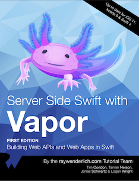

!!! note "为什么要写这个教程"
    因为之前使用`Python`的Web开发框架`Flask`写过一段时间的服务，写的过程中是通过看一个名叫[Flask大型教程][flask mega turorial]的系列博客学习的，
    觉得作者写的很好，也让我感受到了写Web和后台服务的乐趣。

    但是我同时也是一名iOS开发者，对苹果公司新开发的编程语言`Swift`也有非常浓厚的兴趣，正好最近听说`Swift`也可以用来写服务端，就尝试比较了几种流行的框架，包括[Kitura][kitura]、[Perfect][perfect]和[Vapor][vapor]，其中`Kitura`是IBM推出的商业化开发框架，`Perfect`是一个功能非常完善也有些复杂的开源框架，`Vapor`是一个使用纯Swift实现的开源框架，三者在`GitHub`上的星也不少，可以说是目前主流的`Swift`服务端开发框架了。那么我为什么独独对`Vapor`这个框架产生了兴趣呢？

    对`Vapor`有好感，主要是因为[它的官网][vapor]非常简洁，框架使用纯`Swift`实现，同时它的社区非常活跃，项目不是太大，对于我这种不需要太复杂功能的非专职Web/后端开发者来说刚好。

    总之，我选择`Vapor`主要是因为我是个颜控。🤣 我觉得官网可以体现出开发团队的水平，简单的东西总是让人喜欢。

Vapor是一个用Swift语言写的开源框架，基于苹果的SwiftNIO库。可以用来构建iOS应用的后端服务、前端网页应用和独立服务器应用。

Tanner Nelson在2016年1月启动了Vapor项目，很快Logan Wright加入了。之后有很多的人加入了Vapor的开发者社区，因为Vapor使用了Swift风格的API和大量的语言特性，很快在GitHub上成为了流行的服务端Swift框架。随着Swift语言的开源，Vapor也被合并入[`Swift Server Group`][sswg]，成为了苹果官方支持的服务端开发框架。

Vapor包含一些包(Package)，[Leaf][leaf]是一个开发前端页面使用的模板语言，[Fluent][fluent]是一个Swift写的对象关系映射框架。Vapor的长处是它的社区非常活跃，在[Discord][vapor discord]的讨论频道也是如此。

!!! note "怎样学习Vapor"

    1. 看教程，**写代码**
    2. 看文档，**写代码**
    3. 看源码，**写代码**

    要动手 **`写代码`**，理论加实践才能比较扎实的掌握。
    
    本教程的主要内容来自图书[《Server Side Swift With Vapor》][vapor book], 其中大部分是Vapor的核心成员写的，他们知道怎样才能更好的使用Vapor。

    

**按照`IT人`拿起键盘就是干的风格，下一节就是环境配置了。这个过程你可以看到`Vapor`的简洁的特点。**

[flask mega turorial]: <https://blog.miguelgrinberg.com/post/the-flask-mega-tutorial-part-i-hello-world>
[kitura]: <https://www.kitura.dev>
[perfect]: <https://www.perfect.org>
[vapor]: <https://vapor.codes>
[sswg]: <https://www.swift.org/sswg/>
[leaf]: <https://swiftpackageindex.com/vapor/leaf>
[fluent]: <https://swiftpackageindex.com/vapor/fluent>
[vapor discord]: <https://discord.com/invite/vapor>
[vapor book]: <https://store.kodeco.com/products/server-side-swift-with-vapor>