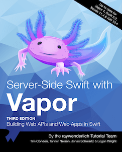

!!! note "为什么要写这个教程"
    因为之前使用[Python]的Web开发框架[Flask]写过一段时间的服务，写的过程中是通过看一个名叫[Flask大型教程][flask mega turorial]的系列博客学习的，
    觉得作者写的很好，也让我感受到了写Web页面和后端服务的乐趣。

    我同时也是一名iOS开发者，对苹果公司开发的编程语言[Swift]也有非常浓厚的兴趣，了解到Swift也可以用来写服务端，就尝试比较了几种流行的框架，包括[Kitura][kitura]、[Perfect][perfect]和[Vapor][vapor]，其中Kitura是IBM推出的商业化开发框架，Perfect是一个功能非常完善也有些复杂的开源框架，Vapor是一个使用纯Swift实现的开源框架，三者在GitHub上的星也不少，可以说是目前主流的Swift服务端开发框架了。那么我为什么独独对Vapor这个框架产生了兴趣呢？

    对Vapor有好感，主要是因为[它的官网][vapor]非常简洁，框架使用纯Swift实现，同时它的社区非常活跃，项目不是太大，对于我这种不需要太复杂功能的开发者来说刚好。

    选择Vapor主要是因为我喜欢简单的东西。🤣 我觉得官网可以体现出开发团队的水平，简单的东西总是让人喜欢。

Vapor是一个用[Swift语言][swift-lang]写的开源框架，基于苹果的[SwiftNIO]库。可以用来构建：后端服务、Web网页。

Tanner Nelson在2016年1月启动了Vapor项目，很快Logan Wright加入了。之后有很多的人加入了Vapor的开发者社区，因为Vapor使用了Swift风格的API和大量的语言特性，很快在[GitHub]上成为了流行的服务端Swift框架。随着Swift语言的开源，Vapor也被合并入[Swift Server Group][sswg]，成为了苹果支持的服务端开发框架。

Vapor包含一些组件，其中[Leaf][leaf]是一个开发前端页面使用的模板语言组件，[Fluent][fluent]是一个Swift写的对象关系映射(ORM)框架。Vapor的开发者社区非常活跃，从[Discord][vapor discord]的讨论频道可以看出来。

!!! note "怎样学习Vapor"

    1. 看教程，**写代码**
    2. 看文档，**写代码**
    3. 看源码，**写代码**

    要动手 **写代码**，理论配合实践才能比较扎实的掌握。
    
    本教程的主要内容来自图书[《Server Side Swift With Vapor》][vapor book]其中大部分是Vapor的核心成员写的，他们知道怎样才能更好的使用Vapor。

    

**按照IT人拿起键盘就是干的风格，下一节就是环境配置了。这个过程你可以看到Vapor的简洁的特点。**

??? info "使用Swift的好处"
    - Swift是强静态类型语言，可以减少应用在运行期的崩溃
    - Swift是编译型语言，比解释型语言性能好
    - Swift对于iOS开发者来说，可以包揽前后端开发，不需要更换语言，并且Swift集众多语言的特点于一身
    - 使用Swift+Xcode开发对于服务端开发来说，有功能齐备的IDE和相关调试能力，这种特性在服务端开发体验是非常棒的，大多数服务端开发语言都没有IDE支持

??? info "使用Vapor开发服务端的好处"
    - iOS开发使用Swift，Vapor也使用相同的语言，在写服务端和客户端应用时，可以复用数据层模型，减少语言切换成本，扩展全栈开发能力
    - Vapor使用了Codable协议，这能够减少许多数据在模型和数据库之间转换格式的相关代码
    - Vapor是完全非阻塞式的架构。阻塞式的架构中，在同一个线程中进行请求和返回请求需要的数据时，如果中间处理操作耗时较多，会出现返回延迟的情况。如果使用多线程的方式进行请求和返回，线程间的切换消耗又会较大。非阻塞的架构中，如果一个请求不能马上返回，会被放在一边，这个请求返回之前的这段时间还可以处理其它请求。
    - Vapor使用[SwiftNIO]实现了非阻塞架构，包括数据库驱动。

[python]: <https://www.python.org/>
[flask]: <https://flask.palletsprojects.com/>
[flask mega turorial]: <https://blog.miguelgrinberg.com/post/the-flask-mega-tutorial-part-i-hello-world>
[Swift]: <https://www.swift.org/>
[kitura]: <https://www.kitura.dev>
[perfect]: <https://www.perfect.org>
[vapor]: <https://vapor.codes>
[sswg]: <https://www.swift.org/sswg/>
[leaf]: <https://swiftpackageindex.com/vapor/leaf>
[fluent]: <https://swiftpackageindex.com/vapor/fluent>
[vapor discord]: <https://discord.com/invite/vapor>
[vapor book]: <https://store.kodeco.com/products/server-side-swift-with-vapor>
[swiftnio]: <https://github.com/apple/swift-nio>
[swift-lang]: <https://docs.swift.org/swift-book/documentation/the-swift-programming-language/>
[github]: <https://github.com>