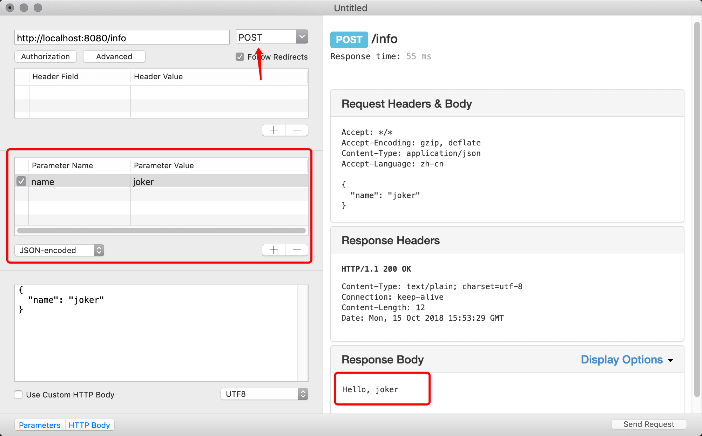

Content协议是Vapor对Codable协议的封装，用来从请求中提取数据。

添加遵守Content协议的结构体InfoData, 它只有一个name字符串成员，Content协议支持请求数据向结构体对象的解码转换。在routes文件中添加下面代码，编译运行

!!! example "POST 请求"
    ```swift hl_lines="20-23 25-27"
    import Vapor

    func routes(_ app: Application) throws {
        app.get { req in
            return "It works!"
        }

        app.get("hello") { req -> String in
            return "Hello, world!"
        }
        
        // Add Routes
        app.get("hello", ":name") { req -> String in
            guard let name = req.parameters.get("name", as: String.self) else {
                return "\(HTTPStatus.notFound)"
            }
            return "Hello, \(name)"
        }
        // ---
        app.post("info") { req -> String in
            let info = try req.content.decode(InfoData.self)
            return "Hello, \(info.name)"
        }
    }
    struct InfoData: Content {
        let name: String
    }
    ```

我们使用`curl`这个工具来测试我们的路由是否正常工作，这个工具是类Linux系统都自带的命令行工具，不存在收费问题，可以免费使用，而且学习后端是必须掌握这个命令行工具的使用方法的：

!!! tip inline end
    -X 表示请求类型: `GET`/`POST`/`PUT`/`DELETE`，默认为`GET`

    -H 请求发起时的Headers设置

    -d 请求发起时所携带的数据

```bash title="curl测试命令"
curl http://localhost:8080/info \
-X POST \
-H "content-type:application/json" \
-d '{"name":"joker"}' 
```

```title="Output"
Hello, joker
```

---

!!! warning
    之前使用一个Mac上名叫[`rested`](https://apps.apple.com/cn/app/rested-simple-http-requests/id421879749?mt=12)的应用，模拟`POST`请求(现在这个App开始收费，不能免费使用了)

    