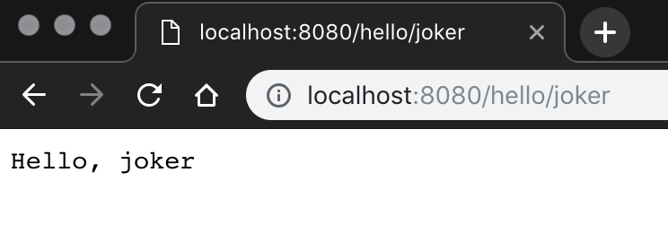

如果你在Linux上开发，可以选择自己喜欢的编辑器来修改文件，然后使用命令行`swift build`和`vapor run`/`swift run`来编译运行。

如果你在Mac上开发，那么可以使用Xcode这个IDE来进行开发。使用`vapor xcode`命令生成可在Xcode中打开的工程。

!!! note "什么是路由(route)"
    当浏览器向服务器发起请求时，服务器接到来自浏览器的请求后会转发给相应端口上提供服务的应用程序，应用程序接收到请求后需要知道调用哪段代码进行相应的处理，我们把客户请求(通常是一个URL)和应用程序针对它进行处理的代码(通常是一个函数)之间的对应关系叫作`route`。
    
    `routes.swift`文件中所作的事，就是建立这种对应关系。

下面添加一个GET类型的路由，在文件routes.swift中添加如下代码，并使用`vapor run`或者直接在Xcode中运行项目：

```swift hl_lines="11-16"
import Vapor
func routes(_ app: Application) throws {
    app.get { req in
        return "It works!"
    }

    app.get("hello") { req -> String in
        return "Hello, world!"
    }
    
    app.get("hello", ":name") { req -> String in
        guard let name = req.parameters.get("name", as: String.self) else {
            return "\(HTTPStatus.notFound)"
        }
        return "Hello, \(name)"
    }
}
```

使用chrome访问我们添加的路由如下图，可见正常工作，其中第二个路由可以接收字符串类型变化的参数：



