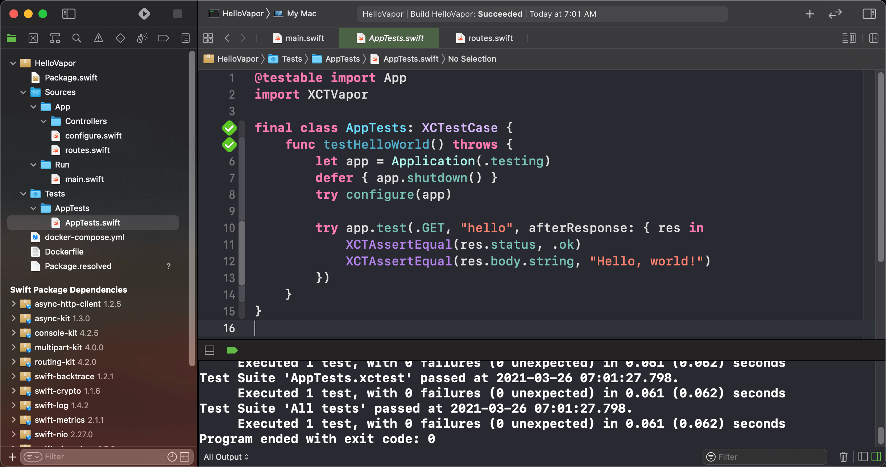

# Vapor模板工程文件结构

!!! note "目录总体结构"

    ```bash
    $ tree -L 1 .
    .
    ├── Dockerfile
    ├── Package.resolved
    ├── Package.swift
    ├── Public
    ├── Sources
    ├── Tests
    └── docker-compose.yml

    3 directories, 4 files
    ```

    - `Package.resolved`解析Package.swift时自动生成的，开发者不需要修改
    - `Package.swift`用来定义一个项目的依赖和生成产物信息
    - `Public`用来存放公共资源文件，包括：图片、CSS样式表、js文件以及Leaf模板文件
    - `Sources`用来存放整个工程的主体源代码文件
    - `Tests`用来存放针对工程功能所写的测试用例的代码文件
    - `docker-compose.yml`部署到docker容器中执行的配置文件，方便部署

!!! hint "Sources子目录"
    ```bash
    $ tree Sources/
    Sources
    ├── App
    │   ├── Controllers
    │   ├── configure.swift
    │   └── routes.swift
    └── Run
        └── main.swift

    3 directories, 3 files
    ```

    Source目录下的每一个子目录都是项目的一个模块。`App`是一个功能模块，`Run`是一个可执行模块，`Run`模块编译后可被操作系统调起运行，`App`模块不可单独运行，它被`Run`模块依赖。

整个程序的运行入口是`main.swift`文件。`Package.swift`文件中描述了整体工程是如何构成的：

!!! hint "Package.swift 项目描述文件"
    ```swift
    // swift-tools-version:5.6
    import PackageDescription

    let package = Package(
        name: "HelloVapor",
        platforms: [
        .macOS(.v12)
        ],
        dependencies: [
            // 💧 A server-side Swift web framework.
            .package(url: "https://github.com/vapor/vapor.git", from: "4.0.0"),
        ],
        targets: [
            .target(
                name: "App",
                dependencies: [
                    .product(name: "Vapor", package: "vapor")
                ],
                swiftSettings: [
                    // Enable better optimizations when building in Release configuration. Despite the use of
                    // the `.unsafeFlags` construct required by SwiftPM, this flag is recommended for Release
                    // builds. See <https://github.com/swift-server/guides/blob/main/docs/building.md#building-for-production> for details.
                    .unsafeFlags(["-cross-module-optimization"], .when(configuration: .release))
                ]
            ),
            .executableTarget(name: "Run", dependencies: [.target(name: "App")]),
            .testTarget(name: "AppTests", dependencies: [
                .target(name: "App"),
                .product(name: "XCTVapor", package: "vapor"),
            ])
        ]
    )
    ```

    从`Package.swift`描述文件中可以看出，每一个Target定义了一个模块，`App`模块依赖了一个第三方的包: `vapor`中的`Vapor`模块，这个被依赖的包的信息在上面的`dependencies`数组中指定，`SPM`会解析它，并拉取相关的文件到本地参与工程编译。

    `Run`可执行模块依赖了`App`功能模块，`App`功能模块又依赖了其它第三方提供的功能模块

    `AppTests`模块依赖了`App`模块，因为它是针对`App`专门写的测试模块，通过运行一个个测试用例，来测试`App`模块的各个功能是否正常。

!!! hint "Tests 子目录"

    ```bash
    $ tree Tests
    Tests
    └── AppTests
        └── AppTests.swift

    1 directory, 1 file
    ```

    在`AppTests.swift`中可以编写测试`App`模块的测试用例。

---

## 示例工程的代码逻辑

???+ "main.swift"
    ```swift hl_lines="8"
    import App
    import Vapor

    var env = try Environment.detect()
    try LoggingSystem.bootstrap(from: &env)
    let app = Application(env)
    defer { app.shutdown() }
    try configure(app)
    try app.run()
    ```

???+ "configure.swift"
    ```swift hl_lines="9"
    import Vapor

    // configures your application
    public func configure(_ app: Application) throws {
        // uncomment to serve files from /Public folder
        // app.middleware.use(FileMiddleware(publicDirectory: app.directory.publicDirectory))

        // register routes
        try routes(app)
    }
    ```

???+ "routes.swift"
    ```swift
    import Vapor

    func routes(_ app: Application) throws {
        app.get { req async in
            "It works!"
        }

        app.get("hello") { req async -> String in
            "Hello, world!"
        }
    }
    ```

以`main.swift`为程序运行的入口，获取到命令行参数以及一些环境变量，用这些信息去创建app，在app运行之前，使用`configure.swift`文件中的函数对app实例进行配置，app实例配置过程中调用`routes.swift`中的方法，对app路由进行配置。

在`HelloVapor`工程根目录下使用`vapor run`或者`swift run`命令编译运行程序即可。

---
## 测试子模块

???+ "AppTests.swift"
    ```swift hl_lines="1"
    @testable import App
    import XCTVapor

    final class AppTests: XCTestCase {
        func testHelloWorld() throws {
            let app = Application(.testing)
            defer { app.shutdown() }
            try configure(app)

            try app.test(.GET, "hello", afterResponse: { res in
                XCTAssertEqual(res.status, .ok)
                XCTAssertEqual(res.body.string, "Hello, world!")
            })
        }
    }
    ```
`AppTests.swift`针对App模块写测试用例，使用了`XCTest`框架，每一个测试用例方法的名称都以`test`开头。在工程根目录下使用`swift test`命令运行测试用例。

!!! note "在Mac上使用Xcode进行Vapor项目的开发"
    在项目根目录下运行`vapor xcode`，生成可以在Xcode中打开的工程文件，使用Xcode运行程序或者测试用例。
    
    - ++cmd+r++ 运行程序
    - ++cmd+u++ 运行测试

    