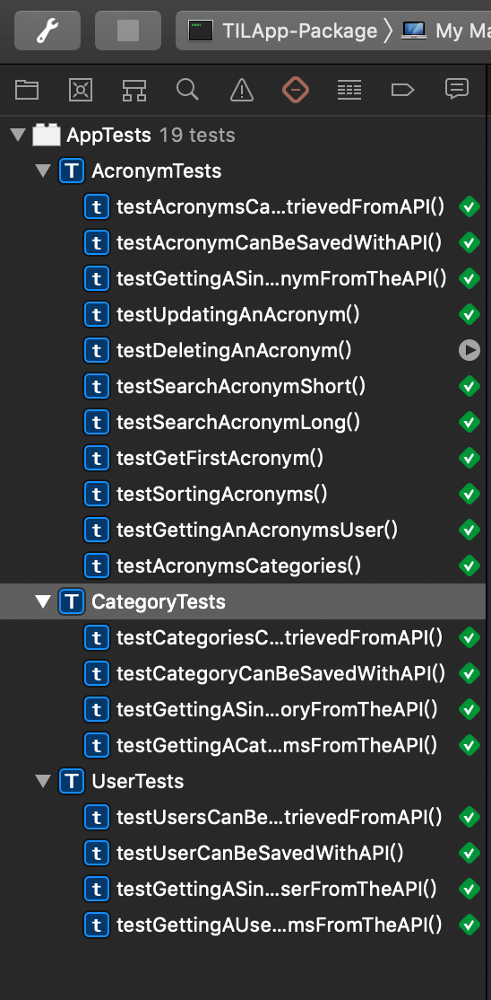

前面我们只写了一个测试用例，下面再多写几个练练手

*UserTests.swift*
```swift
...
    func testUserCanBeSavedWithAPI() throws {
        
        let user = User(name: usersName, username: usersUsername)
        
        let receivedUser = try app.getResponse(to: usersURI,
                                               method: .POST,
                                               headers: ["Content-Type":"application/json"],
                                               data: user,
                                               decodeTo: User.self)
        
        XCTAssertEqual(receivedUser.name, usersName)
        XCTAssertEqual(receivedUser.username, usersUsername)
        XCTAssertNotNil(receivedUser.id)
        
        let users = try app.getResponse(to: usersURI,
                                        decodeTo: [User].self)
        
        XCTAssertEqual(users.count, 1)
        XCTAssertEqual(users[0].name, usersName)
        XCTAssertEqual(users[0].username, usersUsername)
        XCTAssertEqual(users[0].id, receivedUser.id)
    }
    
    func testGettingASingleUserFromTheAPI() throws {
        
        let user = try User.create(name: usersName, username: usersUsername, on: conn)
        
        let receivedUser = try app.getResponse(to: "\(usersURI)\(user.id!)", decodeTo: User.self)
        
        XCTAssertEqual(receivedUser.name, usersName)
        XCTAssertEqual(receivedUser.username, usersUsername)
        XCTAssertEqual(receivedUser.id, user.id)
    }
...
```


# 测试User和Acronym

*Models+testable.swift*
```swift
...
extension Acronym {
    static func create(
        short: String = "TIL",
        long: String = "Today I Learned",
        user: User? = nil,
        on connection: PostgreSQLConnection
        ) throws -> Acronym {
        var acronymUser = user
        if acronymUser == nil {
            acronymUser = try User.create(on: connection)
        }
        
        let acronym = Acronym(short: short, long: long, userID: acronymUser!.id!)
        return try acronym.save(on: connection).wait()
    }
}
```

*UserTests.swift*
```swift
   func testGettingAUsersAcronymsFromTheAPI() throws {
        let user = try User.create(on: conn)
        
        let acronymShort = "OMG"
        let acronymLong = "Oh My God"
        
        let acronym1 = try Acronym.create(short: acronymShort, long: acronymLong, user: user, on: conn)
        _ = try Acronym.create(short: "LOL", long: "Laugh Out Loud", user: user, on: conn)
        
        let acronyms = try app.getResponse(to: "\(usersURI)\(user.id!)/acronyms", decodeTo: [Acronym].self)
        
        XCTAssertEqual(acronyms.count, 2)
        XCTAssertEqual(acronyms[0].id, acronym1.id)
        XCTAssertEqual(acronyms[0].short, acronymShort)
        XCTAssertEqual(acronyms[0].long, acronymLong)
    }
```

# 测试Acronym和Category

*Models+testable.swift*
```swift
extension Category {
    static func create(
        name: String = "Random",
        on connection: PostgreSQLConnection
        ) throws -> Category {
        let category = Category(name: name)
        return try category.save(on: connection).wait()
    }
}
```

测试用例有点多，就不一一写了。可以参看工程代码。


