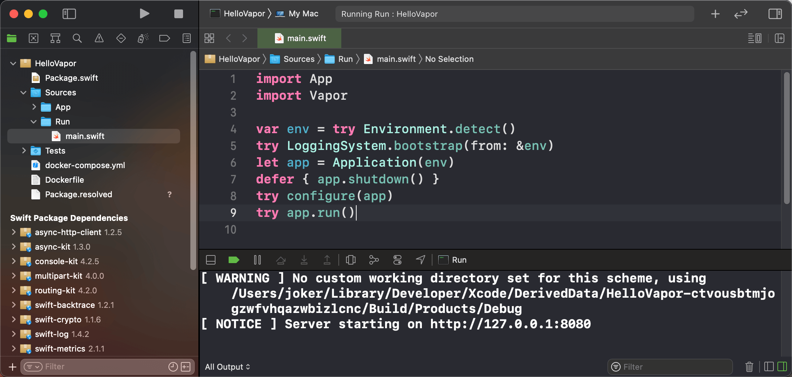

上一节我们通过使用`vapor new`命令，以通用api模板创建了一个项目`HelloVapor`，下面看一下模板项目的目录结构，了解应用的功能模块是如何划分的。

```bash
$ pwd 
/Users/joker/Desktop/vapor/HelloVapor
$ brew install tree
$ tree .
.
├── Dockerfile
├── Package.resolved
├── Package.swift
├── Sources
│   ├── App
│   │   ├── Controllers
│   │   ├── configure.swift
│   │   └── routes.swift
│   └── Run
│       └── main.swift
├── Tests
│   └── AppTests
│       └── AppTests.swift
└── docker-compose.yml

6 directories, 8 files
```

Vapor使用[`Swift Package Manager(SPM)`](https://swift.org/package-manager/)，它是一个依赖管理系统，类似于iOS平台上的Cocoapods，用来配置Vapor应用项目。配置好的Vapor项目之后可以通过调用`swift`工具链进行编译链接，生成可执行程序或者三方库。

一个SPM项目定义在Package.swift框架文件中，这个文件中声明了目标(Target)、依赖(Dependencies)以及怎样把它们链接在一起。项目的布局也和传统的Xcode项目有所不同。

`Source`目录用来存放源文件，`Package.swift`中定义的每一个`Target`都对应`Source`目录下的一个子模块目录。模板项目中声明了两个子模块: `App`和`Run`。
    - `App`模块下存放应用代码逻辑
    - `Run`模块下仅有一个`main.swift`文件，这是swift项目的启动入口。我们在开发过程中不会修改`Run`模块。

`Tests`中存放所有的测试子模块，`Package.swift`中定义的每一个`testTarget`对应一个测试子模块，一个测试子模块针对`Sources`中的一个应用子模块进行测试。

`Package.resolved`文件是对`Package.swift`中描述的依赖关系解析后的结果，用来保存依赖模块的具体信息。

`Dockerfile`和`docker-compose.yml`文件是服务运行于`Docker`容器所需要的构建配置文件，目前可不必关心。

!!! hint "生成可以在Xcode中进行开发的vapor工程"
    ```bash
    $ cd HelloVapor
    $ vapor xcode
    Opening project in Xcode.
    ```
    