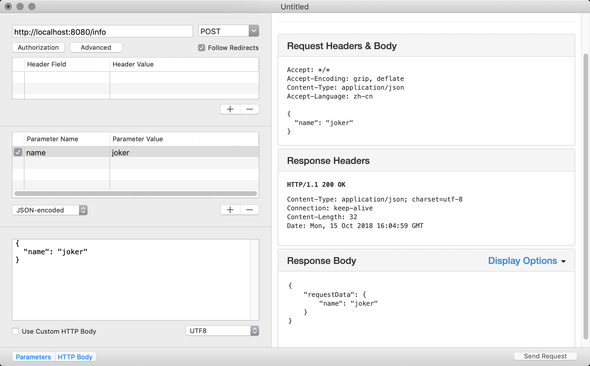

Content协议也可以编码结构体成为JSON数据，在代码中定义一个遵循Content协议的结构体InfoResponse，使用请求数据初始化一个响应结构体对象，直接返回，JSON编码会自动完成，并返回JSON数据给用户。

???+ example "返回JSON数据"

    ```swift hl_lines='34-36 23-24'
    import Vapor

    func routes(_ app: Application) throws {
        app.get { req in
            return "It works!"
        }

        app.get("hello") { req -> String in
            return "Hello, world!"
        }
        
        // Add Routes
        app.get("hello", ":name") { req -> String in
            guard let name = req.parameters.get("name", as: String.self) else {
                return "\(HTTPStatus.notFound)"
            }
            return "Hello, \(name)"
        }
        // ---
        app.post("info") { (req) -> InfoResponse in
            let info = try req.content.decode(InfoData.self)
            
            let response = InfoResponse(requestData: info)
            return response
        }
        
    }


    struct InfoData: Content {
        let name: String
    }

    struct InfoResponse: Content {
        let requestData: InfoData
    }
    ```


使用`resetd`应用测试如下：



