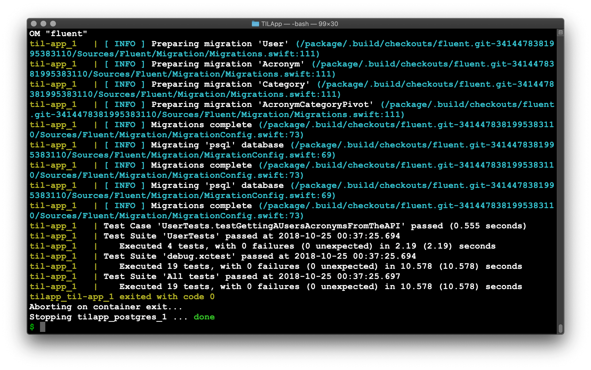

对于服务端应用，在Linux上跑测试用例是很重要的。当我们部署到Vapor Cloud上时，其实部署的操作系统(Linux)和我们开发使用的系统(MacOS)是不同的。Linux上的Foundation库不同于MacOS上的Foundation，MacOS上的Foundation已经被测试使用多年，并且可以使用Objective-C运行时特性，但Linux上的Foundation是纯swift实现的，有一些特性还没有完成实现，相对不稳定，有时会引起崩溃，所以我们必须确保在Linux环境下也能成功跑完所有测试用例。

在MacOS上，可以利用Objective-C的运行时特性，通过检查函数名称前缀为test来识别测试用例。但是在Linux上，由于没有Objective-C运行时特性支持，所有我们必须手动指定哪些函数是测试用例。

在 `Tests`目录下有一个名为`LinuxMain.swift`的文件，它不是Xcode工程的一部分，我们需要在这个文件中手动列出哪些函数是测试用例。

*LinuxMain.swift*
```swift
import XCTest

@testable import AppTests

XCTMain([
    testCase(AcronymTests.allTests),
    testCase(CategoryTests.allTests),
    testCase(UserTests.allTests),
])
```

*UserTests.swift*
```swift
...
static let allTests = [
    ("testUsersCanBeRetrievedFromAPI", testUsersCanBeRetrievedFromAPI),
    ("testUserCanBeSavedWithAPI", testUserCanBeSavedWithAPI),
    ("testGettingASingleUserFromTheAPI", testGettingASingleUserFromTheAPI),
    ("testGettingAUsersAcronymsFromTheAPI", testGettingAUsersAcronymsFromTheAPI)
]
```

*AcronymTests.swift*
```swift
...
static let allTests = [
    ("testAcronymsCanBeRetrievedFromAPI", testAcronymsCanBeRetrievedFromAPI),
    ("testAcronymCanBeSavedWithAPI", testAcronymCanBeSavedWithAPI),
    ("testGettingASingleAcronymFromTheAPI", testGettingASingleAcronymFromTheAPI),
    ("testUpdatingAnAcronym", testUpdatingAnAcronym),
    ("testDeletingAnAcronym", testDeletingAnAcronym),
    ("testSearchAcronymShort", testSearchAcronymShort),
    ("testSearchAcronymLong", testSearchAcronymLong),
    ("testGetFirstAcronym", testGetFirstAcronym),
    ("testSortingAcronyms", testSortingAcronyms),
    ("testGettingAnAcronymsUser", testGettingAnAcronymsUser),
    ("testAcronymsCategories", testAcronymsCategories),
]
```

*CategoryTests.swift*
```swift
...
static let allTests = [
    ("testCategoriesCanBeRetrievedFromAPI", testCategoriesCanBeRetrievedFromAPI),
    ("testCategoryCanBeSavedWithAPI", testCategoryCanBeSavedWithAPI),
    ("testGettingASingleCategoryFromTheAPI", testGettingASingleCategoryFromTheAPI),
    ("testGettingACategoriesAcronymsFromTheAPI", testGettingACategoriesAcronymsFromTheAPI),
]
```


# 使用Docker模拟在Linux上运行测试用例

编辑`Dockerfile`

*Dockerfile*
```docker
FROM swift:4.1

WORKDIR /package

COPY . ./

RUN swift package resolve
RUN swift package clean

CMD ["swift", "test"]
```

编辑`docker-compose.yml`文件

*docker-compose.yml*
```yml
version: '3'

services:
    til-app:
        depends_on:
            - postgres
        build: .
        environment:
            - DATABASE_HOSTNAME=postgres
            - DATABASE_PORT=5432
    postgres:
        image: "postgres"
        environment:
            - POSTGRES_DB=vapor-test
            - POSTGRES_USER=vapor
            - POSTGRES_PASSWORD=password
```

在`configure.swift`文件中作一下测试端口的修改，以适应测试环境变量设定

*configure.swift*
```swift
if let testPort = Environment.get("DATABASE_PORT") {
    databasePort = Int(testPort) ?? 5433
} else {
    databasePort = 5433
}
```


上面都配置好后，在工程目录下，可以在终端运行Linux上的测试用例了：

```bash
$ docker-compose build
$ docker-compose up --abort-on-container-exit
```

