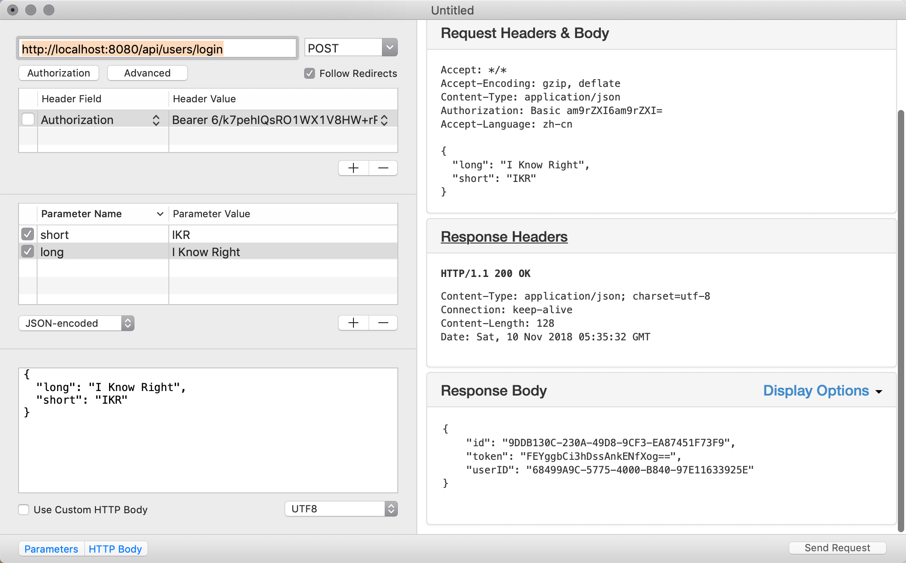
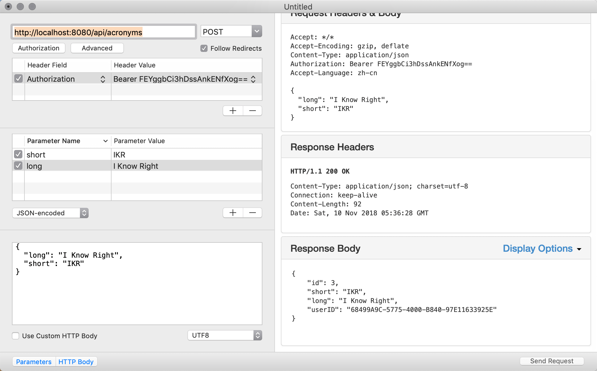

基本认证实现后，只有被认证通过的用户才能创建缩略语。但是其它的请求并没有使用认证保护起来，如果其它请求每次都要输入认证信息头，显然是很麻烦的一件事，如果我们把用户的认证信息存起来，只在请求时用户登录一次，之后的请求使用存起来的认证信息就可以了。但是认证信息不能存用户名和密码的明文，所以我们需要在用户使用我们API的时候进行登录认证，认证通过后，可以发给用户一个已成功登录的凭证(token)，让用户自己存在本地，之后的请求都带上这个已成功登录的凭证进行就可以了。

*Token.swift*
```swift
//
//  Token.swift
//  App
//
//  Created by joker on 2018/11/10.
//

import Foundation
import Vapor
import FluentPostgreSQL
import Authentication

final class Token: Codable {
    var id: UUID?
    var token: String
    var userID: User.ID
    
    init(token: String, userID: User.ID) {
        self.token = token
        self.userID = userID
    }
}

extension Token: PostgreSQLUUIDModel  {}
extension Token: Migration {
    static func prepare(on conn: PostgreSQLConnection) -> Future<Void> {
        return Database.create(self, on: conn) { builder in
            try addProperties(to: builder)
            builder.reference(from: \.userID, to: \User.id)
        }
    }
}
extension Token: Content {}


extension Token {
    static func generate(for user: User) throws -> Token {
        let random = try CryptoRandom().generateData(count: 16)
        return try Token(token: random.base64EncodedString(), userID: user.requireID())
    }
}
```

*configure.swift*
```swift
...
migrations.add(model: Token.self, database: .psql)
...
```

*UserController.swift*
```swift
...
struct UsersController: RouteCollection {
    func boot(router: Router) throws {
        ...    
        let basicAuthMiddleware = User.basicAuthMiddleware(using: BCryptDigest())
        let basicAuthGroup = usersGroup.grouped(basicAuthMiddleware)
        basicAuthGroup.post("login", use: login)
        
    }
    func login(_ req: Request) throws -> Future<Token> {
        let user = try req.requireAuthenticated(User.self)
        let token = try Token.generate(for: user)
        return token.save(on: req)
    }
}
```



*Token.swift*
```swift
...
extension Token: Authentication.Token {
    
    typealias UserType = User
    
    static let userIDKey: UserIDKey = \Token.userID
}

extension Token: BearerAuthenticatable {
    static let tokenKey: TokenKey = \Token.token
}
```
*User.swift*
```swift
extension User: TokenAuthenticatable {
    typealias TokenType = Token
}
```

*AcronymController.swift*
```swift
...
struct AcronymCreateData: Content {
    let short: String
    let long: String
}
struct AcronymsController: RouteCollection {
    func boot(router: Router) throws {
        let routeGroup = router.grouped("api", "acronyms")
        
        let tokenAuthMiddleware = User.tokenAuthMiddleware()
        let guardAuthMiddleware = User.guardAuthMiddleware()
        let protectd = routeGroup.grouped(tokenAuthMiddleware, guardAuthMiddleware)
        protectd.post(AcronymCreateData.self, use: createHandler)
        ...
    }
    
    func createHandler(_ req: Request, data: AcronymCreateData) throws -> Future<Acronym> {
        let user = try req.requireAuthenticated(User.self)
        let acronym = try Acronym(short: data.short, long: data.long, userID: user.requireID())
        return acronym.save(on: req)
    }
    ...
}
```



除createHanler添加了用户认证以外的，其它处理也需要修改,确保只有登录用户才能进行相关操作。除GET请求外都需要修改。对GET请求不处理是为了让非登录用户有读权限。

*AcronymsController*
```swift
...
    protectd.put(Acronym.parameter, use: updateHandler)
    protectd.delete(Acronym.parameter, use: deleteHandler)
    protectd.post(Acronym.parameter,"categories", Category.parameter, use: addCategoriesHandler)
    protectd.delete(Acronym.parameter, "categories", Category.parameter, use: removeCategoriesHandler)
...

    func updateHandler(_ req: Request) throws -> Future<Acronym> {
        return try flatMap(to: Acronym.self, req.parameters.next(Acronym.self), req.content.decode(AcronymCreateData.self)) { (acronym, updateData) -> Future<Acronym> in
            acronym.short = updateData.short
            acronym.long = updateData.long
            
            let user = try req.requireAuthenticated(User.self)
            acronym.userID = try user.requireID()
            
            return acronym.save(on: req)
        }
    }
```

*CategoriesController.swift*
```swift
struct CategoriesController: RouteCollection {
    func boot(router: Router) throws {
        ...
        let tokenAuthMiddleware = User.tokenAuthMiddleware()
        let guardAuthMiddleware = User.guardAuthMiddleware()
        let tokenAuthGroup = categoriesRoute.grouped(tokenAuthMiddleware, guardAuthMiddleware)
        tokenAuthGroup.post(Category.self, use: createHandler)
    }
    ...
```

*UserController.swift*
```swift
    ...
    let tokenAuthMiddleware = User.tokenAuthMiddleware()
    let guardAuthMiddleware = User.guardAuthMiddleware()
    let tokenAuthGroup = usersGroup.grouped(tokenAuthMiddleware, guardAuthMiddleware)
    tokenAuthGroup.post(User.self, use: createHandler)
    ...
```

现在所以可能破坏数据的API都增加了认证中间层保护起来了，只有认证通过的用户才能执行相关操作。
