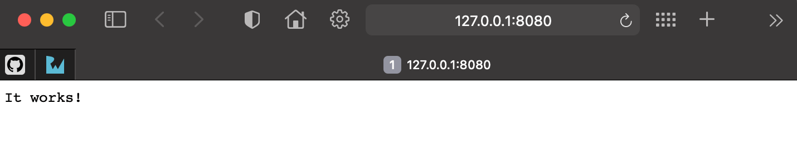
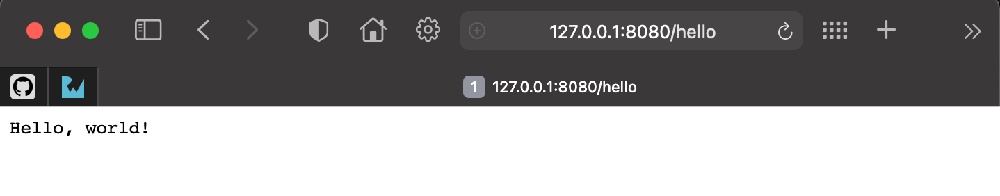

如果你上一节中使用了`vapor --help`命令，你会发现一些有用的信息，其中就有告诉你Vapor工具箱能做哪些事情。

Vapor工具箱是一个命令行工具，可以帮助开发Vapor应用。它可以从指定模板创建应用、可以调用Swift工具链来构建和运行项目、
可以生成项目的对应Xcode项目，除此之外，还可以把应用部署到云上环境。


```bash
$ vapor --help
Usage: vapor <command>

Vapor Toolbox (Server-side Swift web framework)

Commands:
        build Builds an app in the console.
        clean Cleans temporary files.
       heroku Commands for working with Heroku.
          new Generates a new app.
          run Runs an app from the console.
              Equivalent to `swift run Run`.
              The --enable-test-discovery flag is automatically set if needed.
    supervisor Commands for working with supervisord.
        xcode Opens an app in Xcode.

Use `vapor <command> [--help,-h]` for more information on a command.
```

- `vapor build`用来构建应用，在构建之前，vapor需要按工程依赖关系拉取指定依赖。
- `vapor clean`是用来清理构建过程中生成的一些临时文件或中间产物，这些东西有时会引起一些奇怪的构建错误，所以在发生莫名的构建错误时，可以尝试使用这个命令清理一下临时文件，
重新构建，看看能不能解决问题。
- `vapor heroku`是把应用部署到[heroku](https://www.heroku.com/)云平台上，这个平台也是很有名气的。
- `Vapor new`命令可以从模板创建工程，这种模板可以是自定义的，
也可以是github上其它人的定义的。
- `vapor run`运行构建成功的应用，等价于命令：`swift run Run`。
- `vapor supervisor` [supervisor]是一个Python写的类Unix系统下的进程管理工具，Vapor使用这个命令可以创建对应supervisor的配置文件，在Vapor项目部署到服务器上后，可以对其进行生命周期管理
- `vapor xcode`在MacOS平台上使用Xcode打开工程文件，方便使用Xcode进行开发。另外一种方法是使用`open Package.swift`命令，因为新版本的Xcode已经默认支持了Swift Package Manager项目，所以系统可以识别出来，并调用Xcode打开对应的SPM项目。

这些命令会在之后的实践中用到，慢慢熟悉并使用它们。

---

下面使用`vapor new`来创建一个项目并运行，作为示例。

!!! example "1. 创建项目示例"
    ```bash
    $ mkdir ~/vapor
    $ cd ~/vapor
    $ vapor new HelloVapor
    ```
    创建时会提示我们是否需要使用`Fluent`和`Leaf`，输入`n`，目前我们不需要使用。

    `Fluent`是与数据库交互的ORM框架，`Leaf`是web开发时使用的模板语言框架。

!!! example "2. 运行项目示例"
    ```bash 
    $ cd HelloVapor
    $ vapor run
    Updating https://github.com/vapor/vapor.git
    Fetching https://github.com/vapor/multipart-kit.git
    Fetching https://github.com/apple/swift-nio.git
    ......
    [1462/1462] Linking Run
    [ NOTICE ] Server starting on http://127.0.0.1:8080
    ```

    !!! warning
        第一次运行会比较耗时，因为它要从GitHub上拉取一些依赖的代码仓库到本地后再进行编译。GitHub在中国有可能会被DNS污染，访问不太稳定。国内的朋友需要使用一些GitHub访问加速方案，如果有合法代理可以访问国际互联网的方式是最好的。

    目前服务已经运行在 <http://127.0.0.1:8080>，可以通过浏览器进行访问。

    

    !!! tip "端口占用查询"
        有时在运行应用时会发现想要监听的端口已经被其它的应用程序绑定了，此时可以使用命令查看一下到底是谁在使用。
        在MacOS上，终端键入命令`lsof -i tcp:8080`可以查看指定端口当前被哪些应用使用。然后使用`pkill <APP_NAME>`来关闭这些占用端口的应用。
        如果占用端口的应用很重要，那么你就要考虑换一个端口来监听运行你的Vapor项目了。


!!! hint "查看Vapor API项目的所有路由信息"
    
    可以通过下面命令，查看这个api项目提供的所有可用路由信息了： 

    ```bash
    $  vapor run routes
    +-----+--------+
    | GET | /      |
    +-----+--------+
    | GET | /hello |
    +-----+--------+
    ```

    项目模板默认提供两个route：`/`和`/hello`, 用浏览器访问一下试试：

    - <http://localhost:8080/>

    - <http://localhost:8080/hello>

    


!!! note "切换服务运行的端口和主机地址"
    使用`vapor run`命令运行项目，默认是在监听`127.0.0.1:8080`，所以你只能从本机访问。如果要指定端口和允许任意IP地址访问API，可以使用下面的命令运行:
    ```bash
    vapor run serve --hostname 0.0.0.0 --port 80
    ```
    运行起来后，我们就可以在内网中的任何设备上访问了到刚刚开发的API了，例如可以使用手机浏览器访问电脑的内网IP，验证API服务正常工作。


[supervisor]: <https://github.com/Supervisor/supervisor>